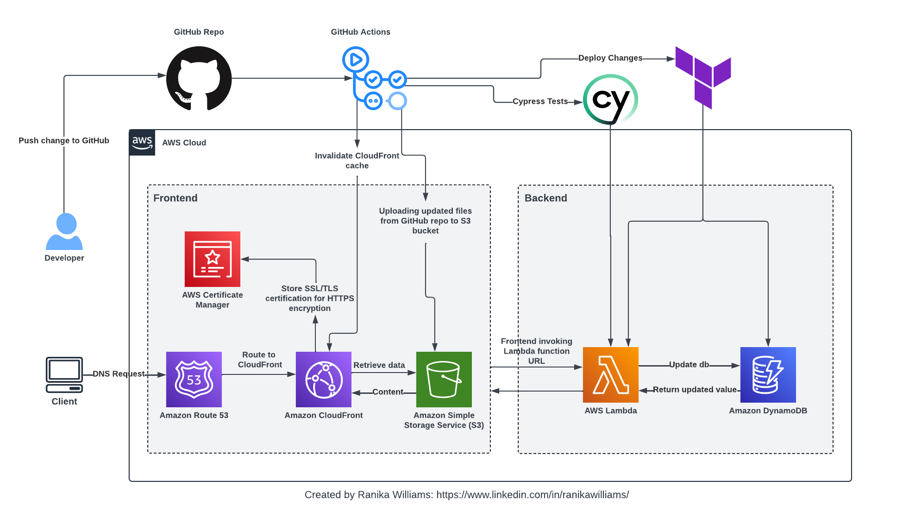

---

# Cloud Resume Challenge Project Frontend

This project is a serverless full-stack web application built based on the [Cloud Resume Challenge](https://cloudresumechallenge.dev/). It consists of a front and back end hosted on AWS services, with infrastructure managed using Terraform. The CI/CD pipeline is implemented using GitHub Actions, and testing conducted using Cypress. 

The backend portion of this project can be found in this [repository](https://github.com/rnkwilliams/aws-cloud-resume-challenge-backend). The deployed web app can be found [here](https://www.ranikaresume.com/).

## Architectural Diagram
This diagram explains the structure of the full-stack project:

## Frontend

The application's frontend is hosted on AWS S3 (Simple Storage Service) to store HTML, CSS, and JavaScript files and is served globally via CloudFront for fast content delivery to users. Route 53 is used for DNS management and to point internet traffic to a CloudFront distribution. Amazon Certificate Manager is used for SSL/TLS certificate management and handling the TLS connection established between the client, providing a secure HTTPS connection.

## Continuous Integration/Continuous Deployment (CI/CD)

The frontend utilizes GitHub Actions to synchronize the S3 bucket whenever code is pushed to this repository. Upon uploading the files, the CloudFront cache is invalidated, providing near-real-time updates to the webpage.

## Getting Started

To deploy the application, follow these steps:

1. Clone the front-end and back-end repositories.
2. Install dependencies for each component.
3. Set up Terraform with appropriate AWS credentials.
4. Configure GitHub Actions workflow for CI/CD.
5. Run tests using Cypress.
6. Deploy the application using Terraform.

## Contributing
Feel free to contribute, suggest improvements, or report issues by opening an issue or pull request on the GitHub repository.

## License
This project is licensed under the MIT License.

---
